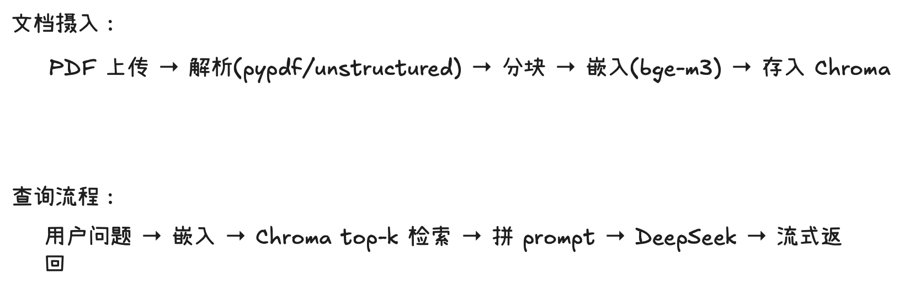

# Legal Doc QA

基于 RAG 的法律文档问答系统。

## 架构



## 项目结构

```
legal-doc-qa/
├── app/
│   ├── api/         # FastAPI 路由
│   ├── core/        # 配置、日志
│   ├── ingestion/   # 文档解析 + 分块 + 入库
│   ├── retrieval/   # 检索逻辑
│   ├── generation/  # Prompt + LLM 调用
│   └── models/      # Pydantic 模型
├── tests/
├── docs/            # 架构图、设计文档
├── data/            # 测试用 PDF
└── docker/
```
